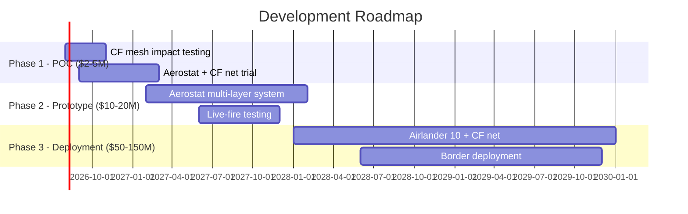

# Executive Summary: Carbon Fiber Net Defense from Airships

**Subject: Feasibility Research — Passive Aerial Defense Using Carbon Fiber Nets Deployed from Lighter-Than-Air Platforms**

---

## Key Finding

Deploying carbon fiber mesh nets from zeppelins/airships at altitudes of 1–6 km is a **technically feasible, economically viable** concept for passive area-denial defense against drones, loitering munitions (Shaheds), and cruise missiles.

**Feasibility Score: 8.4/10** | Research Date: July 3, 2026

---

## The Problem

- Fiber-optic FPV drones are **immune to ALL electronic warfare** — no jamming, no spoofing, no detection
- Current defense costs are **unsustainable**: $3–4M Patriot missiles vs $10–30K drones (ratio: 150:1–300:1)
- Mass saturation attacks (100–700 drones/night) **overwhelm active systems**
- No existing system provides passive, reusable, zero-cost-per-intercept aerial defense
- **80+ Hezbollah FPV attacks** against IDF in southern Lebanon in recent weeks (July 2026)

---

## The Solution

| Parameter | Value |
|-----------|-------|
| Material | Carbon fiber mesh (20mm grid) |
| Weight | 140–160 g/sqm (20mm); 108 g/sqm (50mm) |
| Cost | $4–10/sqm (commodity pricing) |
| Strength | ≥3,000 MPa tensile |
| Platform | Tethered aerostats (near-term) → Airlander 10 airship (medium-term) |
| Coverage | 2,500–50,000 sqm per platform |
| Cost per intercept | **$0** (passive, reusable) |
| Deployment timeline | 6–12 months (aerostat POC) |

### How It Works

1. **Against drones**: Physical blockage destroys airframe
2. **Against missiles**: Triggers super-quick fuse → premature detonation at safe distance
3. **Against fiber-optic FPV**: Only physical barriers work — CF net is the solution

---

## Cost Analysis

| Scenario | Cost | Notes |
|----------|------|-------|
| 100 Patriot missiles | $300–400M | Consumed after single use |
| Ukraine 4-month defense | $2.1–2.8B | 700 Patriot-class interceptors fired |
| 1× Airlander 10 + CF net | $50–60M | Permanent, passive, reusable |
| 3× tethered aerostats + CF | $6–15M | 30-day endurance, repairable |

---

## Border Defense Application (Israel)

| Border | Length | Aerostats Needed | Airlanders | Investment |
|--------|--------|-----------------|------------|-----------|
| Israel-Lebanon | 79–120 km | 24–36 (74K + 420K) | 2–3 | $170–430M |
| Israel-Syria (Golan) | ~80 km | 14–22 (74K + 420K) | 1–2 | $90–264M |
| Israel-Jordan | 482 km | 40–64 (chokepoints) | 1 | $141–405M |
| **Total** | **~640 km** | **78–122** | **4–6** | **$401M–$1.1B** |

**Context**: Israel's defense budget >$30B/year. Iron Dome cost ~$3B. One night's Patriot defense costs $200M+.

### Airship Self-Protection
- Helium airships remain flyable after **hundreds of bullet holes** (US/UK live-fire testing)
- Missiles **unlikely to fuse** on contact with soft envelope
- Low acoustic, IR, and RF signatures
- Operate 50–200km behind front lines, at 3–6km altitude (beyond MANPADS range)
- Russia's "Barrier" system (2024) validates the balloon+net concept at tactical level

---

## Validation

- **Patents exist**: PCNS (EP3769030A1), AB-Net (AIAA 2008-6863) — both validate net-based missile defense
- **Combat-proven concept**: Ground mesh barriers already intercept drones at 120+ km/h in Ukraine/Lebanon
- **Platforms operational**: TCOM aerostats deployed by US military for decades; 8 TARS on US southern border
- **Supply chain ready**: CF mesh produced at 750,000 sqm/week per factory
- **Russia developing same concept**: "Barrier" system by First Airship — tested, initial orders received (2024)

---

## Recommended Next Step

**Fund $2–5M proof-of-concept** using existing TCOM 74K aerostat + commodity carbon fiber mesh.
Timeline: 6 months to live demonstration.

---

*Full research document (40+ pages) available upon request.*  
*Research date: July 3, 2026 | Classification: UNCLASSIFIED — Open Source*

### References (Selected)

| # | Source | Verified |
|---|--------|----------|
| 1 | HAV Airlander 10 specifications | Yes |
| 2 | TCOM Aerostat Fact Sheet 2024 | Yes |
| 3 | Ukraine War Analytics 2026 | Yes |
| 4 | PCNS Patent EP3769030A1 | Yes |
| 5 | AB-Net AIAA 2008-6863 | Yes |
| 6 | US Navy ONR LTA Report 2006 | Yes |
| 7 | Business Insider / Newsweek — Russia Barrier system | Yes |
| 8 | BBC / CNN / Foreign Policy — Hezbollah FPV drones | Yes |
