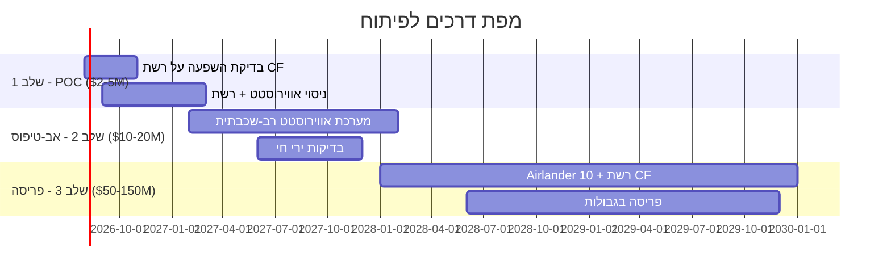

# תקציר מנהלים: הגנה באמצעות רשתות סיבי פחמן מכלי טיס קלים מאוויר

**נושא: מחקר היתכנות — הגנה אווירית פסיבית באמצעות רשתות סיבי פחמן הנפרשות מפלטפורמות קלות-מאוויר (צפלינים/אווירוסטטים)**

---

## ממצא מרכזי

פריסת רשתות סיבי פחמן מצפלינים/כלי טיס קלים-מאוויר בגבהים של 1–6 ק"מ היא **קונספט ישים טכנית וכלכלית** להגנה פסיבית נגד מל"טים, תחמושת משוטטת (שאהד), וטילי שיוט.

**ציון היתכנות: 8.4/10** | תאריך מחקר: 3 ביולי 2026

---

## הבעיה

- מל"טי FPV עם סיב אופטי **חסינים לחלוטין ללוחמה אלקטרונית** — אין שיבוש, אין הונאה, אין זיהוי
- עלויות ההגנה הנוכחיות **אינן בנות קיימא**: טיל Patriot ב-$3–4M מול מל"ט ב-$10–30K (יחס: 150:1–300:1)
- התקפות הצפה (100–700 מל"טים/לילה) **מציפות מערכות אקטיביות**
- אין מערכת קיימת שמספקת הגנה אווירית פסיבית, רב-פעמית, בעלות אפס ליירוט
- **80+ התקפות FPV של חיזבאללה** נגד כוחות צה"ל בדרום לבנון בשבועות האחרונים (יולי 2026)

---

## הפתרון

| פרמטר | ערך |
|--------|------|
| חומר | רשת סיבי פחמן (רשת 20 מ"מ) |
| משקל | 140–160 גרם/מ"ר (20 מ"מ); 108 גרם/מ"ר (50 מ"מ) |
| עלות | $4–10/מ"ר (מחיר סחורה) |
| חוזק | ≥3,000 MPa מתיחה |
| פלטפורמה | אווירוסטט מקושר (טווח קרוב) → Airlander 10 (טווח בינוני) |
| כיסוי | 2,500–50,000 מ"ר לפלטפורמה |
| עלות ליירוט | **$0** (פסיבי, רב-פעמי) |
| לוח זמנים | 6–12 חודשים (הוכחת היתכנות) |

### מנגנון הפעולה

1. **נגד מל"טים**: חסימה פיזית הורסת את שלד המל"ט
2. **נגד טילים**: מפעיל נצרה מיידית (SQ fuse) → פיצוץ מוקדם במרחק בטוח מהמטרה
3. **נגד FPV סיב אופטי**: רק מחסום פיזי עובד — רשת CF היא הפתרון

---

## ניתוח עלויות

| תרחיש | עלות | הערות |
|--------|------|-------|
| 100 טילי Patriot | $300–400M | נצרכים לאחר שימוש בודד |
| הגנת אוקראינה ל-4 חודשים | $2.1–2.8B | 700 מיירטים מסוג Patriot שוגרו |
| 1× Airlander 10 + רשת CF | $50–60M | קבוע, פסיבי, רב-פעמי |
| 3× אווירוסטטים + רשת CF | $6–15M | סיבולת 30 יום, ניתן לתיקון |

---

## יישום הגנת גבולות (ישראל)

| גבול | אורך | אווירוסטטים | ספינות אוויר | השקעה |
|-------|-------|-------------|-------------|--------|
| ישראל-לבנון | 79–120 ק"מ | 24–36 (74K + 420K) | 2–3 | $170–430M |
| ישראל-סוריה (גולן) | ~80 ק"מ | 14–22 (74K + 420K) | 1–2 | $90–264M |
| ישראל-ירדן | 482 ק"מ | 40–64 (נקודות חנק) | 1 | $141–405M |
| **סה"כ** | **~640 ק"מ** | **78–122** | **4–6** | **$401M–$1.1B** |

**הקשר**: תקציב הביטחון של ישראל >$30B/שנה. כיפת ברזל עלתה ~$3B. לילה אחד של הגנת Patriot עולה $200M+.

### הגנה עצמית של ספינות אוויר
- ספינות אוויר הליום נשארות ברות-טיסה גם אחרי **מאות חורי קליעים** (ניסויי ירי חי ארה"ב/בריטניה)
- טילים **לא צפויים לנצר** במגע עם מעטפת רכה
- חתימות אקוסטיות, IR ו-RF נמוכות
- פעילות 50–200 ק"מ מאחורי קו החזית, בגובה 3–6 ק"מ (מעבר לטווח MANPADS)
- מערכת "Barrier" של רוסיה (2024) מאמתת את הקונספט בלון+רשת ברמה טקטית

---

## אימות

- **פטנטים קיימים**: PCNS (EP3769030A1), AB-Net (AIAA 2008-6863) — שניהם מאמתים הגנת רשת נגד טילים
- **מוכח בקרב**: מחסומי רשת קרקעיים כבר מיירטים מל"טים ב-120+ קמ"ש באוקראינה/לבנון
- **פלטפורמות מבצעיות**: אווירוסטטים של TCOM בשימוש צבא ארה"ב עשרות שנים; 8 TARS בגבול הדרומי של ארה"ב
- **שרשרת אספקה מוכנה**: רשת CF מיוצרת ב-750,000 מ"ר/שבוע למפעל
- **רוסיה מפתחת קונספט דומה**: מערכת "Barrier" של First Airship — נבדקה, הזמנות ראשונות התקבלו (2024)

---

## צעד מומלץ

**מימון הוכחת היתכנות ב-$2–5M** באמצעות אווירוסטט TCOM 74K קיים + רשת סיבי פחמן מסחרית.
לוח זמנים: 6 חודשים עד הדגמה חיה.

---

*מסמך מחקר מלא (40+ עמודים) זמין לפי בקשה.*  
*תאריך מחקר: 3 ביולי 2026 | סיווג: לא מסווג — מחקר קוד פתוח*

### מקורות (נבחרים)

| # | מקור | מאומת |
|---|------|-------|
| 1 | מפרטי HAV Airlander 10 | כן |
| 2 | מפרט TCOM Aerostat 2024 | כן |
| 3 | Ukraine War Analytics 2026 | כן |
| 4 | פטנט PCNS EP3769030A1 | כן |
| 5 | AB-Net AIAA 2008-6863 | כן |
| 6 | דו"ח US Navy ONR LTA 2006 | כן |
| 7 | Business Insider / Newsweek — מערכת Barrier רוסית | כן |
| 8 | BBC / CNN / Foreign Policy — מל"טי FPV חיזבאללה | כן |
